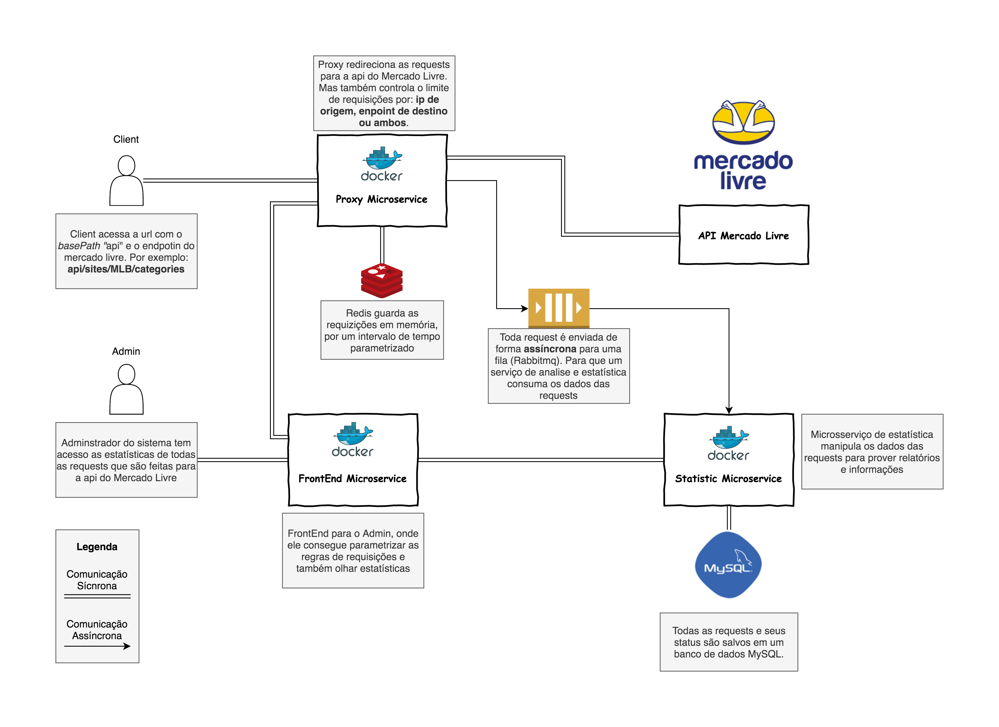

# Meli Proxy 

O projeto Meli Proxy tem como objetivo, mais do que fornecer um proxy das requizições 
do Mercado Livre mas também controlar o fluxo dessas requizições e prover uma forma de 
se tirar estatísicas e informações sobre todas as requizições. 

Controlamos o límite máximo de requizições por:

* IP de origem
* Path de destino
* E ambos

Todos os límites são parametrizaveis, bem como também o tempo de expiração 
das requests.

### Requisitos para todar o projeto
````
Maven 3.6.0
Java version 8
Docker version 19.03.8
Git version 2.19.0
````

### Instalação do Projeto

```bash
$ git clone https://github.com/DanielAcaz/meli-proxy.git
$ cd meli-proxy

# Para subir a infraestrutura no docker e testar os microsserviços pela IDE 

$ docker-compose up --build  

# Para subir todas as aplicações e infraestrutura no docker

$ docker-compose -f docker-compose.yml -f docker-compose.prod.yml up --build
$ ...go have a coffe  

```
### Atenção!
Os endereços de portas a seguir precisam estar disponíveis no seus sistema:

* 8080
* 8081
* 13306
* 15672
* 5672
* 6379

## Arquitetura do Projeto

Antes de rodar projeto é importante entender como ele foi planejado.

As aplicações que compõem o projeto são:

* RabbitMQ
* Redis
* MySQL
* Proxy Microservice
* Statistic Microservice

O fluxo do projeto obedece a seguinte ordem dentro das aplicações:

1. O client faz uma requizição para o domínio do Mercado Livre. O Proxy Microservice 
intercepta a requizição. A aplicação valida se é a requisição não tem nenhuma das 
regras de limite excedidas. Caso não tenha, ele cria um registro no Redis e também envia 
a request para o RabbitMQ. Caso tenha excedido, o proxy bloqueia a request e retorna o 
status 403 (Probído).

2. O Redis tem a reponsabilidade de salvar e prover as inforamções das requests de 
forma performática. Ele tem um tempo de expiração de dados parametrizados, para deixar 
salvo apenas as requests usadas para validação das próximas requests. Basicamente o Redis 
serve para prover a informação se uma request excedeu os limites parametriaados ou não.

3. O RabbitMQ tem como função armazenar de forma assíncrona todas as requests que 
passam pelo proxy, mesmo as bloqueadas. Para não onerar o tempo de processamento do
proxy a fila segura as requests até que o microsserviço de estatísicas as receba. 
Isto serve para que o proxy não fique esperando o serivço de estatística responder.

4. O microsserivço de estatísica pega todas as requests da fila e guarada elas em um 
banco de dados, para depois poder prover esses dados para análise e estatística das 
requests. Ele tem alguns endpoints para que os dados possam ser acessados.

5. O MySQL é o banco usado para guardar os dados do microsserviço de estatística.

Abaixo existe a imagem da arquitetura descrita nos tópicos acima, para um melhor entendimento:

<p align="center">
    
</p>  

 