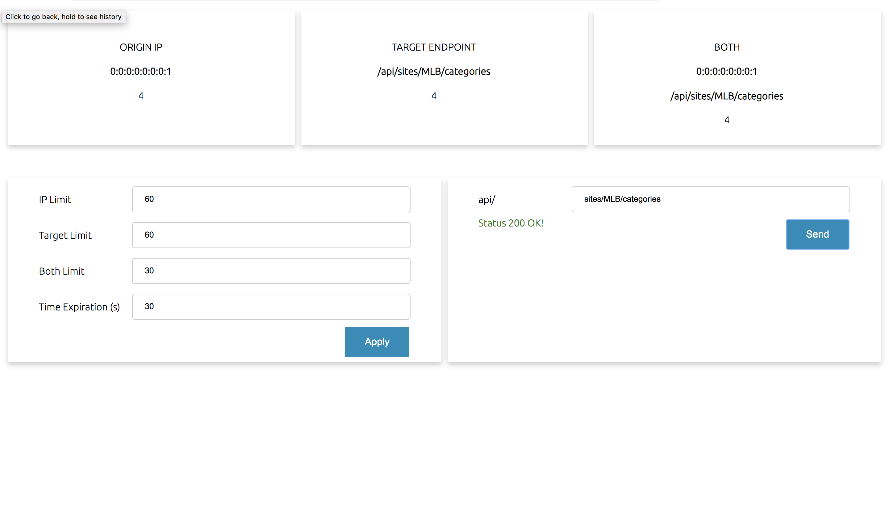

# Proxy 

O projeto Proxy tem como objetivo, mais do que fornecer um proxy das requisições mas também controlar o fluxo dessas requizições e prover uma forma de 
se tirar estatísticas e informações sobre todas as requisições. 

Controlamos o limíte máximo de requisições por:

* IP de origem
* Path de destino
* E ambos

Todos os limítes são parametrizáveis, bem como também o tempo de expiração 
das requests.

### Sumário

- [Startup do Projeto](#startup-do-Projeto)

    - [Requisitos para todar o projeto](#requisitos-para-todar-o-projeto)

    - [Instalação do Projeto](#instalação-do-projeto)

    - [Atenção!](#atenção)

- [Tela de Parametrização](#tela-de-parametrização)

- [Arquitetura do Projeto](#arquitetura-do-projeto)

- [Endpoints do Projeto](#endpoints-do-projeto)

## Startup do Projeto

### Requisitos para rodar o projeto
````
Maven 3.6.0
Java version 8
Docker version 19.03.8
Git version 2.19.0
````

### Instalação do Projeto

```bash
$ git clone https://github.com/DanielAcaz/meli-proxy.git
$ cd meli-proxy

# Para subir a infraestrutura no docker e testar os microsserviços pela IDE 

$ docker-compose up --build  

# Para subir todas as aplicações e infraestrutura no docker

$ docker-compose -f docker-compose.yml -f docker-compose.prod.yml up --build
$ ...go have a coffe  

```
### Atenção!
Os endereços de portas a seguir precisam estar disponíveis no seu sistema:

* 8080
* 8081
* 13306
* 15672
* 5672
* 6379
* 80

## Tela de Parametrização

Existe um front-end desenvolvido para que um usuário Admin possa parametrizar 
e olhar as estatísticas das requests enviadas.

Abaixo existe a imagem do front-end para parametrização e análise estatística. Logo depois uma 
explicação de cada campo da tela:

<p align="center">
    
</p>  

- Na parte de cima da tela temos três cards mostrando: O ip de origem com a maior quantidade de requests, 
o endpoint mais requisitado e, por fim, o endpoint e o ip de origem mais usados em uma mesma request.

- Em baixo, no lado esquerdo temos o formulário de parametrização contendo: Limite máximo que um ip pode fazer uma requisição,
limíte máximo que um endpoint pode ser chamado, o limite máximo que podemos ter o mesmo ip e o mesmo endpoint em uma request e 
o tempo de expiração onde os limites são renovados.

- No lado direito temos um formulário de teste que quando digitamos um endpoint e enviamos o comando, ele verifica que se 
a chamada foi permitida (Status 200 Ok) ou se ela foi proibida (Status 403 Forbiden)

## Arquitetura do Projeto

Antes de rodar projeto é importante entender como ele foi planejado.

As aplicações que compõem o projeto são:

* RabbitMQ
* Redis
* MySQL
* Proxy Microservice
* Statistic Microservice
* Fron-End Microsservice

O fluxo do projeto obedece a seguinte ordem dentro das aplicações:

1. O client faz uma requisição para um domínio expecífico. O Proxy Microservice 
intercepta a requisição. A aplicação valida se a requisição não tem nenhuma das 
regras de limíte excedidas. Caso não tenha, ele cria um registro no Redis e também envia 
a request para o RabbitMQ. Caso tenha excedido, o proxy bloqueia a request e retorna o 
status 403 (Proibido).

2. O Redis tem a responsabilidade de salvar e prover as informações das requests de 
forma performática. Ele tem um tempo de expiração de dados parametrizados, para deixar 
salvo apenas as requests usadas para validação das próximas requests. Basicamente o Redis 
serve para prover a informação se uma request excedeu os limites parametrizados ou não.

3. O RabbitMQ tem como função armazenar de forma assíncrona todas as requests que 
passam pelo proxy, mesmo as bloqueadas. Para não onerar o tempo de processamento do
proxy a fila segura as requests até que o microsserviço de estatísticas as receba. 
Isto serve para que o proxy não fique esperando o seriviço de estatística responder.

4. O microsserivço de estatística pega todas as requests da fila e guarda elas em um 
banco de dados, para depois poder prover esses dados para análise e estatística das 
requests. Ele tem alguns endpoints para que os dados possam ser acessados.

5. O MySQL é o banco usado para guardar os dados do microsserviço de estatística.

6. O microsserviço do Front-End abriga a tela de parametrização explicada anteriormente.


Abaixo existe a imagem da arquitetura descrita nos tópicos acima, para um melhor entendimento:

<p align="center">
    
</p>  

## Endpoints do Projeto

##### Microsserviço Proxy

 - Documentação no swager
 ```bash
 curl GET http://localhost:8080/swagger-ui.html
 ```
 - Acessar um domínio 
 ```bash
  curl GET http://localhost:8080/api/{domain}
  ```
 - Ler os parâmetros de limites das requests:
 ```bash
 curl GET http://localhost:8080/parameters
 ```
 - Atualizar os parâmetros de limites das requests
 ```bash
 curl PUT -H "Content-Type: application/json" -d '{ "limitOrigin": 60, "limitTarget": 30, "limitBoth": 5, "expirationTime": 10 }' http://localhost:8080/parameters 
 ```

 ##### Microsserviço Statistic
 
 - Documentação no swager
  ```bash
  curl GET http://localhost:8081/swagger-ui.html
  ```
  - Ler todas as requests:
  ```bash
  curl GET http://localhost:8081/requests/all
  ```
  
  - Ler os atributos (ip e path) de maior quantidade de request:
```bash
curl GET http://localhost:8081/requests/most
```
